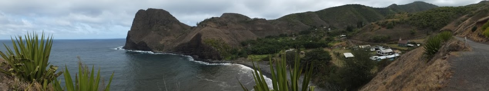
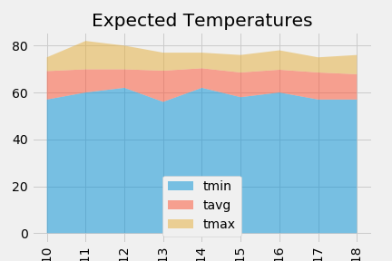

# sqlalchemy-challenge
My wife and I plan to vacation in Hawaii, March 10th - 18th.  We chose to stay in Waihee, because the weather station data is relatively reliable, and how can you have a good day without weather?

The temperature range and extremes are so inviting, as winter turns to spring.

In addition to my favorite speedo and turtleneck, I plan to bring a poncho to handle 0.22" rain.